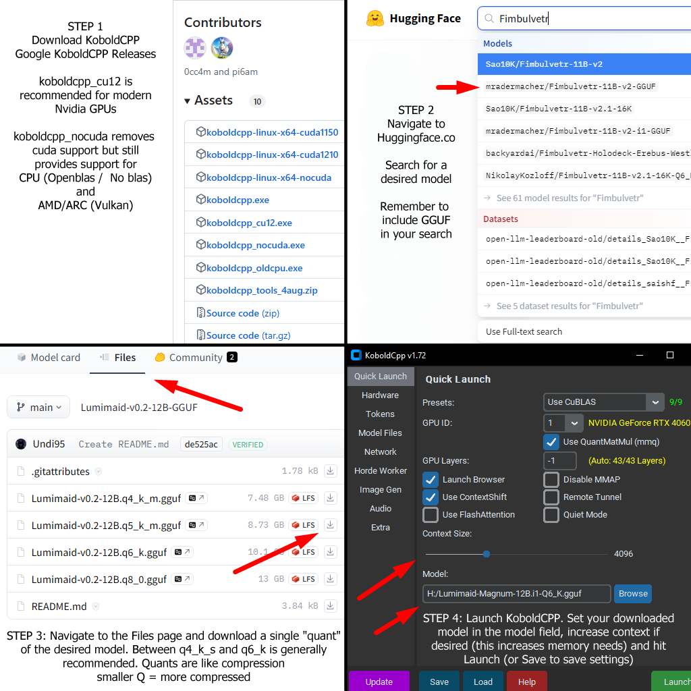

# KoboldAI Quickstart


## Install
Windows:

{width=75%}
Or as text:
From https://github.com/LostRuins/koboldcpp/releases download the file ending in `.exe`.
 - NVidia users download koboldcpp_cu12.exe
 - AMD and Intel GPU users download koboldcpp_nocuda.exe
 - CPU ONLY users download koboldcpp.exe
 - If all above options fail, download koboldcpp_oldcpu.exe


Linux:

```bash
sudo curl -fLo /usr/bin/koboldcpp https://koboldai.org/cpplinux && sudo chmod +x /usr/bin/koboldcpp
```
Alternatively:
 - NVidia users with a 20 series or newer download koboldcpp-linux-x64-cuda1210
 - NVidia users with a 10 series or older download koboldcpp-linux-x64-cuda1150
 - All others download koboldcpp-linux-x64-nocuda


MacOS:

```zsh
curl -fLo ~/Applications/koboldcpp-mac-arm64 https://koboldai.org/cppmac && chmod +x ~/Applications/koboldcpp-mac-arm64
```

> MacOS optional: *If you double click the file in finder it will produce a error message regarding security, but in system settings you could afterwards choose to override it, so you can even start the GUI from finder by double clicking it then. It's under Settings/Security/Allow App if you scroll to the bottom in the Security chapter and then when you once click "open anyway" he remembers and whitelists KoboldCPP.*

## Setup

**Settings in one overview:**

  

*(Image guide originally from /lmg/, thanks anon)*


Full descriptions of launcher settings:
### Quick Launch:
 - #### Presets
  - Use CPU: This will ignore your GPU if you have one. rarely the best option.
  - use CuBLAS: This will use Cuda on an NVidia GPU. if you have no NVidia GPU, then do not use (unless you know what you are doing)
  - Use Vulkan: This will use Vulkan on any GPU or APU. This is recommended for Intel GPUs as the default option, and for AMD GPUs when ROCM isnt an option.
  - Use CLBlast: This is a graphics card agnostic option like Vulkan, but generally slower.
  - (old cpu) options: like the above, however they should be used only as a fallback when the above has a crash related to hardware incompatibility.
 - #### GPU ID:
  - This will show up to 4 GPUs on your system, you can use this to select which GPU to utilize, or use the "ALL" option to utilize all available GPUs.
 - #### GPU Layers:
  - Layers are parts of a model, different models will have different numbers of layers, such as Gemma 3 having 63 layers. There will not be a comprehensive list provided as every model has a different count. Other than the first layer (input) and last layer (output) Layers are generally the same size. typically this means you can divide the file size by the layer count to determine the size of each layer.
  - This setting tells kobold how much of the model to put on the GPU and how much should remain on the system ram, more layers on GPU will generally be faster.
  - -1: This will attempt to find the amount of vram available and set the model to offload a layer less than the expected max capacity. This generally will work, but manual editing can get it more precise.
  - Any other number: if the number is greater than the number of layers in the model, it will load all layers on the GPU. 
 - #### Launch Browser:
  - This will use your system default HTTP/HTTPS protocol handler to open the browser. (This will open your default browser to kobold automatically once the model is loaded)
 - #### Use MMAP: 
  - Use Memory Map, this generally speeds up loading of the model as it "holds" the memory when it starts loading rather than waiting for it to need more memory to load the next chunk of the model. On some hardware this causes the model to not "unload" properly, but generally should be safe to enable
 - #### Use ContextShift:
  - reduces reprocessing when continuing a conversation with the LLM. Very rarely will turning this off provide benefits, however some models do fail with it.
 - #### Remote Tunnel:
  - Creates a public URL for you to access remotely. the public URL will be in the log and will last up to 3 days. Closing the program will close the tunnel early
 - #### Quiet Mode:
  - Do not display messages in the log. Use this to hide what other people send your system if you dont want to know.
 - #### Use FlashAttention: 
  - This is disabled by default due to being hardware and model dependent.
  - On NVidia and some AMD GPUs this will significantly improve prompt processing.
  - On CPU and some AMD GPUs this will significantly degrade prompt processing
  - If you do not have full offload of the model (set GPU layers to max) then this may cause slowdowns
 - #### Context Size:
  - How much information the model can see at once. See "Context" in begginer dictionary
 - #### GGUF Text Model:
  - You can download from HuggingFace or a few other smaller options a GGUF or GGML file, GGML being an older and no longer recommended format.
  - If you do not feel like downloading manually, you can use HF Search to automatically download the model

Further reading: 

### beginner dictionary:
Prompt: Everything before the AI responds. ie: this is your question, the previous conversation after reloading, the information in the context pane, and any previous messages by the AI
Prompt Processing (pp): speed of processing the prompt, generally this is significantly faster on NVidia than other options. 
Context: Every message is turned into "tokens" each token is anywhere from 1 letter to a short phrase. The tokens and their association are considered the "context".
Token: A short series of characters (can be a single character) that is represented as a single value. models are trained on these "tokens" rather than the individual characters that make up the word. Generally 1/4 the character count is the number of tokens, however it varies by model base
VRAM: Dedicated memory for your GPU, rather than your CPU. for instance, an NVidia RTX 3090 has 24GB VRAM, and a GTX 1080 TI has 11 GB vram. This effectively controls how big a model you can load.
Kobold CPP: The current version of Kobold, this is where you are now.
Kobold AI: an older version of Kobold run on Python instead of C++, no longer developed
Kobold Lite: The web interface of Kobold AI and Kobold CPP
Quanting: Reduces size of a model by rounding numbers. A simple example is Pi being 3.14159265358979323846264338327… but being rounded to 3.14. This greatly reduces the size of the model and minimum required computer specs to run it, but it does so by reducing accuracy. The larger the size, the less impactful this is.
Embeddings: Similar to Context, however its able to be stored separate from the model. Unlike context, its not a single ordered list of tokens and context, its a jumbled database instead. The database can then be searched and provide the tokens back, allowing the llm to see older messages effectively.