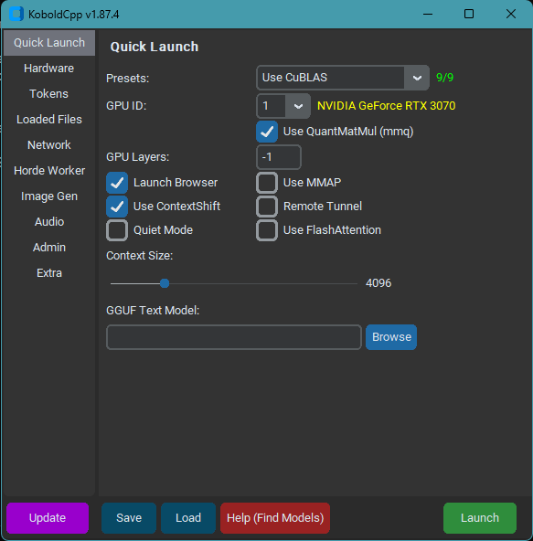

# KoboldCpp

## What is KoboldCpp?

KoboldCpp is an easy-to-use AI server software for GGML and GGUF LLM models. It's a single package that builds off llama.cpp and adds a versatile KoboldAI API endpoint, packed with a lot of features. 

KoboldCpp delivers you the power to run your text-generation, image-generation, text-to-speech and speech-to-text locally. All with additional abilities like applying LoRAs, using mmproj and configuring all settings to your liking.

KoboldCpp delivers advance Network capabilities, supports setting up an AI Horde worker and provides Server side storage (if enabled as Admin). 

We also bundle KoboldCpp with a StableDiffusion WebUI and our flagship UI KoboldAI Lite with persistent stories, editing tools, save formats, memory, world info, author's note, characters, scenarios and everything we have to offer. Both UIs are optional to use and only load if you access the endpoints, so this bundle comes at no costs on your side.

**KoboldCpp is a full fledged AI server, in active development, up to date with models and technology, opensource and driven by a dedicated community and excellent core development team.**

Our optional GUI Starter for easy setup:



##KoboldCpp knowledgebase introduction

Welcome to the KoboldCpp knowledgebase! If you have issues with KoboldCpp, please check if your question is answered here or in one of the link reference first. If not, you can open an issue on Github, or contact us on our [KoboldAI Discord Server](https://koboldai.org/discord). You can the main developer there as Concedo, or just ask around (we have plenty of people around to help).

## Getting an AI model file
### **What models does KoboldCpp support? What architectures are supported?**  
KoboldCpp supports various GGML and GGUF models of a few select formats (Also includes backward compatibility for older versions/legacy GGML models, though some newer features might be unavailable):  
- LLAMA and LLAMA2 (LLaMA / Alpaca / GPT4All / Vicuna / Koala / Pygmalion 7B / Metharme 7B / WizardLM and many more)
- GPT-2 / Cerebras / Starcoder
- GPT-J
- RWKV
- GPT-NeoX / Pythia / StableLM / Dolly / RedPajama
- MPT models
- Mistral and Mixtral
- Phi2

Other formats such as safetensors and pytorch.bin models are not natively supported, and must be converted to GGUF/GGML! (see below)  

### **Where can I find or download GGUF and GGML models for KoboldCpp?**  
- GGML models can be found uploaded on [Huggingface](https://huggingface.co/models), simply by searching for `GGML` or `GGUF`. They should be a file in `.bin` or `.gguf` format
- A large selection of high quality models can also be found on [TheBloke's Huggingface Repo](https://huggingface.co/TheBloke), look for GGUF/GGML. 
- Lastly, you can also convert the models yourself, using the [appropriate conversion tools](https://github.com/LostRuins/koboldcpp/releases/download/v1.50.1/koboldcpp_ggml_tools_21nov.zip). 

### **What's the difference between GGUF and GGML formats**  
GGUF is a newer format designed to (hopefully) be more future proof. As of Oct 2023, it is the latest and recommended format for LLAMA and LLAMA2 models. For other architectures, the old format is still used. KoboldCpp remains compatible with any version of both formats.

### **What are the differences between the different files for each model? Do I need them all? Which Quantization? F16? Q4_0? Q5_1?**  
No, you don't need all the files, just a single one. Each GGML model is just a single .bin or .gguf file. The multiple files represent different compression levels of each model, from worst to best (least to most bits-per-weight) in ascending order. A Q4_0 of a specific model will be smaller than a Q5_1, but of slightly lower quality. [Read more here](https://www.reddit.com/r/LocalLLaMA/comments/13l0j7m/a_comparative_look_at_ggml_quantization_and/).
- In general the quality (from worst to best) and filesize (from smallest to biggest) follows this order: 
- Q2K, Q3_K_S, Q3_K_M, Q3_K_L, Q4_0, Q4_K_S, Q4_1, Q4_K_M, Q5_0, Q5_1, Q5_K_S, Q5_K_M, Q6_K, Q8_0, F16

## Quick Start
### **How do I get started with KoboldCpp? What do I need? How do I compile KoboldCpp from source code?**  
This depends on the platform you are using, and what capabilities you want to use. First, download a GGML .bin file as stated above. Next: 
- Windows, Using Prebuilt Executable (Easiest):  
  - [Download the latest koboldcpp.exe release here](https://github.com/LostRuins/koboldcpp/releases/latest)
  - Double click KoboldCPP.exe and select model OR run "KoboldCPP.exe --help" in CMD prompt to get command line arguments for more control.
  - Generally you don't have to change much besides the `Presets` and `GPU Layers`. Run with CuBLAS or CLBlast for GPU acceleration.
  - Select your GGUF or GGML model you downloaded earlier, and connect to the displayed URL once it finishes loading. 

- Linux, Precompiled Binary or AutoInstall script (Easy):  
  - On Linux, we provide a `koboldcpp-linux-x64` PyInstaller prebuilt binary on the **[releases](https://github.com/LostRuins/koboldcpp/releases/latest)** page for modern systems. Simply download and run the binary. 
  - Alternatively, you can also install koboldcpp to the current directory by running the following terminal command: `curl -fLo koboldcpp https://github.com/LostRuins/koboldcpp/releases/latest/download/koboldcpp-linux-x64 && chmod +x koboldcpp`. 
  - When you can't use the precompiled binary directly, we provide an automated build script which uses conda to obtain all dependencies, and generates (from source) a ready-to-use a pyinstaller binary for linux users. Simply execute the build script with `./koboldcpp.sh dist` and run the generated binary.

- MacOS and Linux (Self Compile):  
  - You will have to compile your binaries from source. First, [clone the latest version of the repo here](https://github.com/LostRuins/koboldcpp).
  - A makefile is provided, simply run `make`
  - To use OpenBLAS, link your own install of OpenBLAS manually with `make LLAMA_OPENBLAS=1`. You will need to have OpenBLAS installed.
  - Alternatively, if you want you can also link your own install of CLBlast manually with `make LLAMA_CLBLAST=1`, for this you will need to obtain and link OpenCL and CLBlast libraries.
    - For Arch Linux: Install `cblas` `openblas` and `clblast`.
    - For Debian: Install `libclblast-dev` and `libopenblas-dev`.
  - You can attempt a CuBLAS build with `make LLAMA_CUBLAS=1` or using the provided CMake file, you will need CUDA toolkit installed.
  - For a full featured build, do `make LLAMA_OPENBLAS=1 LLAMA_CLBLAST=1 LLAMA_CUBLAS=1`
  - After all binaries are built, you can run the python script with the command `koboldcpp.py [ggml_model.gguf] [port]`
- MacOS Notes:
  - You may want to compile with `make LLAMA_METAL=1`, and enable it afterwards by passing --gpulayers (number)
  - Note: Many MacOS users have found that the using Accelerate is actually faster than OpenBLAS. To try, you may wish to run with `--noblas` and compare speeds.  
  
- Windows, Compiling from Source Code:  
  - You're encouraged to use the .exe released, but if you want to compile your binaries from source at Windows, the easiest way is:
  - Use the latest release of w64devkit (https://github.com/skeeto/w64devkit). Be sure to use the "vanilla one", not i686 or other different stuff. If you try they will conflict with the precompiled libs!
  - Note: w64devkit uses Linux commands instead of the typical windows commands, so you would use `ls` to change the current directory.
  - Make sure you are using the w64devkit integrated terminal, then run 'make' at the KoboldCpp source folder. This will create the .dll files.
  - If you want to generate the .exe file, make sure you have the python module PyInstaller installed with pip ('pip install PyInstaller').
  - Run the script make_pyinstaller.bat at a regular terminal (or Windows Explorer).
  - The koboldcpp.exe file will be at your dist folder.
- If you wish to use your own version of the additional Windows libraries (OpenCL, CLBlast and OpenBLAS), you can do it with:
  - OpenCL - tested with https://github.com/KhronosGroup/OpenCL-SDK . If you wish to compile it, follow the repository instructions. You will need vcpkg.
  - CLBlast - tested with https://github.com/CNugteren/CLBlast . If you wish to compile it you will need to reference the OpenCL files. It will only generate the ".lib" file if you compile using MSVC.
  - OpenBLAS - tested with https://github.com/xianyi/OpenBLAS .
  - Move the respective .lib files to the /lib folder of your project, overwriting the older files.
  - Also, replace the existing versions of the corresponding .dll files located in the project directory root (e.g. libopenblas.dll).
  - Make the KoboldCPP project using the instructions above.
  - For CuBLAS, you need to use the provided CMake file with Visual Studio and CUDA Toolkit installed. If you use the CMake file to build, copy the koboldcpp_cublas.dll generated into the same directory as the koboldcpp.py file. If you are bundling executables, you may need to include CUDA dynamic libraries (such as cublasLt64_11.dll and cublas64_11.dll) in order for the executable to work correctly on a different PC.  
  
- Android: 
  - Please refer to the "Installing KoboldCpp on Android via Termux" guide below.
  
- WSL:
  - You could, but why would you want to? The basic `make` should work without issues with build essentials. Finding appropriate libraries for GPU acceleration may be difficult.
 
## KoboldCpp General Usage and Troubleshooting  
### **I don't want to use the GUI launcher. How to use the 'command line/terminal' with extra parameters to launch koboldcpp?**  
Here are some easy ways to start koboldcpp from the command line. Pick one that suits you best.  
- Windows: Go to Start > Run (or WinKey+R) and input the full path of your koboldcpp.exe followed by the launch flags. e.g. `C:\mystuff\koboldcpp.exe --usecublas --gpulayers 10`. Alternatively, you can also create a desktop shortcut to the koboldcpp.exe file, and set the desired values in the `Properties > Target` box. Lastly, you can also start command prompt in your koboldcpp.exe directory (with `cmd`), and pass the desired flags to it from the terminal window.  
- Linux/OSX: Navigate to the koboldcpp directory, and build koboldcpp with `make` (as described in 'How do I compile KoboldCpp'). Then run the command `python3 koboldcpp.py --model (path you your model)`, plus whatever flags you need e.g. `--useclblast` or `--stream`

### **How do I see the available commands and how to use them?**  
You can launch KoboldCpp from the command line with the `--help` parameter to view the available command list. See the section on "How to use the command line terminal"

### **How much RAM/VRAM do I need to run Koboldcpp? What about my GPU?**  
The amount of RAM required depends on multiple factors such as the context size, quantization type, and parameter count of the model. In general, assuming a 2048 context with a Q4_0 quantization:
- LLAMA 3B needs at least 4GB RAM
- LLAMA 7B needs at least 8GB RAM
- LLAMA 13B needs at least 16GB RAM
- LLAMA 30B needs at least 32GB RAM
- LLAMA 65B needs at least 64GB RAM  

Offloading layers to the GPU VRAM can help reduce RAM requirements, while a larger context size or larger quantization can increase RAM requirements.
For number of layers to offload, see the section on GPU layer offloading.

### **What does GPU layer offloading do? How many layers can I offload?**  
Just running with `--usecublas` or `--useclblast` or `--usevulkan` will perform prompt processing on the GPU, but combined with GPU offloading via `--gpulayers` takes it one step further by offloading individual layers to run on the GPU, for per-token inference as well, greatly speeding up inference. The number of layers you can offload to GPU vram depends on many factors, some of which are already mentioned above, and can also change depending on which backend (CUDA/CL/Metal) that you are using. For reference, at 2048 context in Q4_0, a 6GB Nvidia RTX 2060 can comfortably offload:
- 32 layers with LLAMA 7B
- 18 layers with LLAMA 13B
- 8 layers with LLAMA 30B

### **How can I run KoboldCpp on my android phone (Termux)?**  
Inference directly on a mobile device is probably not optimal as it's likely to be slow and memory limited. Consider running it remotely instead, as described in the "Running remotely over network" section. If you still want to proceed, the best way on Android is to build and run KoboldCpp within Termux. Also, check out the guide below "Installing KoboldCpp on Android via Termux".

- [Install and run Termux from F-Droid](https://f-droid.org/en/packages/com.termux/)
- Enter the command `termux-change-repo` and choose `Mirror by BFSU`
- Install dependencies with `pkg install wget git python` (plus any other missing packages)
- Install dependencies `apt install openssl` (if needed)
- Clone the repo `git clone https://github.com/LostRuins/koboldcpp.git`
- Navigate to the koboldcpp folder `cd koboldcpp`
- Build the project `make`
- Grab a small GGUF model, such as `wget https://huggingface.co/TheBloke/phi-2-GGUF/resolve/main/phi-2.Q2_K.gguf`
- Start the python server `python koboldcpp.py --model phi-2.Q2_K.gguf`
- Connect to `http://localhost:5001` on your mobile browser
- If you encounter any errors, make sure your packages are up-to-date with `pkg up`

### **What are my options to make it go FASTER? (CuBLAS/CLblast/OpenBLAS/Metal/Accelerate/ROCm/Vulkan)**  
By default, launching with no parameters set will use CPU only OpenBLAS for prompt processing and inference. This can be slow for big models and big prompts.  
Here are some options to Make It Fast:  
- CuBLAS: Only for Nvidia GPUs. Launch with `--usecublas` to use this. Prepackaged for windows .exe users, but requires installing CUDA toolkit for all other platforms (see compiling with CUDA from source, OSX/Mac section). Can be combined together with `--gpulayers` for even faster GPU offloading.
- CLblast: For most GPUs, including Nvidia, AMD, and Intel iGPUs. Launch with `--useclblast [platformID] [deviceID]` to use this. Prepackaged for windows .exe users, but requires installing CLBlast library for all other platforms (see compiling with CLBlast from source, OSX/Mac section). Can be combined together with `--gpulayers` for even faster GPU offloading.
- OpenBLAS: CPU only, no GPU needed. Automatic on windows, but can be disabled by setting `--noblas` or `--blasbatchsize -1`. Requires installing OpenBLAS library for other platforms. 
- Metal: Only for Apple Silicon users (eg. Mac M2), GPU acceleration with Metal. Can be combined together with `--gpulayers`. See compiling with Metal from source.
- Accelerate: Only for mac users, CPU only, faster than OpenBLAS. Automatically supported if you build on a mac. If BLAS is slowing you down, try `--noblas`.
- ROCm: Not directly supported, but see [YellowRoseCx/koboldcpp-rocm](https://github.com/YellowRoseCx/koboldcpp-rocm) fork via HIPBLAS for AMD devices only.
- Vulkan: Now supported, Vulkan is a newer option that provides a good balance of speed and utility compared to the OpenCL backend.

### **What values do I put for the `--useclblast [platform] [device]` command?**  
The two values to use represent the Platform ID and Device ID of your target GPU. For most systems, it will be 0 and 0 for the default GPU, e.g. `--useclblast 0 0`, but if you have more than 1 GPU, you can also try `--useclblast 1 0` and `--useclblast 0 1` with trial and error (it will print out the name of each selected device). When launching with CLBlast, the list of available GPUs and their IDs will then be printed in sequence to the terminal, which you can use as a reference. Also, another way to get the actual value to use is with the command line program `clinfo`, which will display the platform and device IDs for all your GPUs.

### **How do I run KoboldCpp on a different device than my PC over the network? Remote play?**  
There are multiple ways to use KoboldCpp on a different device over the network.  
1. If on a different LAN (Windows or Linux) - Use a Cloudflared tunnel. After launching KoboldCpp with default port 5001, run the `Remote-Link.cmd` included in the repo, which will create a cloudflared tunnel. Then just open your mobile browser to the displayed trycloudflare URL. In newer versions of KoboldCpp, there's a helper command to do all that for you, simply use `--remotetunnel` and it will proceed to setup a tunnel with a usable URL.
2. If on a different LAN (Any, Public) - Use the AI Horde. KoboldCpp comes with an embedded AI Horde worker (see section on Horde). You can start a worker, and then connect to it via the web version of Kobold Lite at https://lite.koboldai.net
3. If on same LAN - If you're on the same Wifi network, you can probably connect over LAN by navigating to the local IP of the host device (the PC running koboldcpp). For example, http://192.168.1.85:5001 or similar, check your LAN IP address. If that fails, try using the `--host` option with your LAN IP. If you setup port forwarding to a public IP, then it will be accessible over the internet as well.
4. There is a [Colab Notebook](https://github.com/LostRuins/koboldcpp/blob/concedo/colab.ipynb) included here. It should work out of the box. use it at your own risk.

### **What port does Koboldcpp use? How do I change the port that koboldcpp uses?**  
By default KoboldCpp uses port 5001, but this can be changed with the `--port` launch parameter. You would connect your browser locally to that port for the UI or API, in the format http://localhost:port (e.g. http://localhost:5001). If the connection does not work, check your wifi or firewall settings, or try using a different port.

### **How do I use streaming? What are the types of streaming supported?**  
KoboldCpp now supports a variety of streaming options. Kobold Lite UI supports streaming out of the box, which can be toggled in Kobold Lite settings.  _Note: the `--stream` parameter is now deprecated and should not be used._ 
- Polled-Streaming (Recommended): This is the default used by the Kobold Lite UI. It polls for updates on the `/api/extra/generate/check` endpoint every second. It is relatively fast and simple to use, although some may find it a bit "chunky" as it does not update instantaneously every single token.
- Pseudo-Streaming: This is an older method that is no longer recommended, due to performance overheads. To use it with Kobold Lite, enable streaming, then append a `&streamamount=x` at the end of the Lite URL where X is the number of tokens per request. Negative performance impact.
- SSE (True Streaming): This type of streaming is only supported by a few third party clients such as SillyTavern and Agnaistic, available only via the API. It provides instantaneous per-token updates, but requires a persistent connection and some special handling on the client side with SSE support. This mode is not used in Lite or the main KoboldAI client. It uses a different API endpoint, so configure this from your third party client according to their provided instructions.

### **How to choose how many threads to use? What about `--blasthreads`?**  
Set number of threads to be used for inference. The optimal number of threads to use is usually approximately equal to the number of physical CPU cores your system has. So a i7-9750H with 12 logical processors and 6 physical cores would do best with either 5 or 6 threads. Setting `--blasthreads` will use a different number of threads during BLAS if specified. Otherwise, has the same value as `--threads`. Tf you leave the parameter blank, it will be set to a good default also based on slightly less than your CPU count. If running with full GPU offload, then setting 1 thread may be enough.  
_Note: The flag `psutil_set_threads` has been deprecated and should not be used._

### **What is BLAS? What is blasbatchsize? How does it affect me?**  
BLAS (Basic Linear Algebra Subprograms) is what is used to perform large matrix to matrix multiplication, which is needed for accelerated prompt processing. There are multiple backends this can be done with, such as CuBLAS(Nvidia), CLBlast(OpenCL), or OpenBLAS(CPU). The `--blasbatchsize` indicates the number of tokens in a single batch to be processed at once. Usually, you do not need to change this value (defaults to 512 for llama and 256 otherwise), but you can try lower values such as 128 for devices with less memory, at the expense of lower prompt processing speeds. BLAS is not used during stochastic sampling (generation).

### **What is Mirostat? How do I use it?**  
Mirostat is a newer sampling method that adjusts the value of k in top-k decoding to keep the perplexity within a specific range. In this way, it avoids two common problems in text generation: the boredom trap, in which the generated text becomes repetitive, and the perplexity trap, in which the generated text loses coherence. It can be used as a replacement for more classic samplers like Top-P, if enabled it replaces your samplers with mirostat. Takes 3 parameters = [type(0/1/2), tau(5.0), eta(0.1)]. Mirostat can now also be set on a per-generation basis within the API.  
_Note: the `--usemirostat` launch parameter has been deprecated and should not be used._

### **What is Grammar Sampling**  
Grammar Sampling allows you to specify a GBNF grammar format to be used when generating, constraining the AI to a specific syntax in the response. For more info, check out [this link](https://github.com/ggerganov/llama.cpp/pull/1773).

### **What is `--config`? What are .kcpps files?**  
`.kcpps` files are configuration files that store your KoboldCpp launcher preferences and settings. You can save and load them into the GUI, or run them directly with the `--config` flag.

### **What is `--multiuser` mode?**  
Multiuser mode allows multiple people to share a single KoboldCpp instance, connecting different devices to a common endpoint (over LAN, a port forwarded public IP, or through an internet tunnel). It automatically handles queuing requests and dispatching them to the correct clients. An optional extra parameter number allows you to specify the max simultaneous users.

### **What is `--foreground`**  
This parameter is intended for window users. It sends the console terminal to the foreground every time a new prompt is generated, to avoid some idling slowdown issues.

### **What is `--quiet`**  
This parameter prevents prompt and generation output information from being displayed on the terminal. Useful for added privacy.

### **What is `--preloadstory`**  
You can pass a Kobold Lite JSON file with this parameter when launching the KoboldCpp server. The save file will automatically be served and loaded to any new Kobold Lite clients who connect to your server, effectively giving you a preconfigured story that you can easily share over the network.

### **What is `--chatcompletionsadapter`**  
You can pass an optional ChatCompletions Adapter JSON file to force custom instruct tags when launching the KoboldCpp server. This is useful when using the OpenAI compatible Chat Completions API with third party clients. The adapter file takes the following JSON format.

```
{
"system_start":"str",
"system_end":"str",
"user_start":"str",
"user_end":"str",
"assistant_start":"str",
"assistant_end":"str"
}
```

### **How to use `--onready`**  
This is an advanced parameter intended for script or command line usage. You can pass a terminal command (e.g. start a python script) to be executed after Koboldcpp has finished loading. This runs as a subprocess, and can be useful for starting cloudflare tunnels, displaying URLs etc.

### **How do I stop my model from generating (specific symbol), e.g. `[`**  
Sometimes, you want to prevent a model from using a specific symbol, e.g. the left square bracket `[` like Kobold United does. Using the flag `--bantokens [` will remove ALL tokens that contain the specific substring. For example, `--bantokens a e` will prevent the model from using the letters "`a`" or "`e`" in the output.  
- Logit Bias: For advanced users. Setting `logit_bias` over the API allows you to prioritize or reduce the chance of specific token IDs appearing in the AI output, without banning it completely.

### **What is Smart Context?**  
Smart Context is enabled via the command `--smartcontext`. In short, this reserves a portion of total context space (about 50%) to use as a 'spare buffer', permitting you to do prompt processing much less frequently (context reuse), at the cost of a reduced max context.  
How it works: when enabled, Smart Context can trigger once you approach max context, *and* then send two consecutive prompts with enough similarity (e.g. the second prompt has more than half the tokens matching the first prompt). Imagine the max context size is 2048. When triggered, KoboldCpp will truncate away the first half of the existing context (top 1024 tokens), and 'shift up' the remaining half (bottom 1024 tokens) to become the start of the new context window. Then when new text is generated subsequently, it is trimmed to that position and appended to the bottom. The new prompt need not be recalculated as there will be free space (1024 tokens worth) to insert the new text while preserving existing tokens. This continues until all the free space is exhausted, and then the process repeats anew.

> Analogy: Imagine there is a Bus with a capacity for 50 seats. At each stop, 5 people want to get on. Now imagine that once the bus is full, the driver has to kick out the earliest 5 passengers off the bus, before the next 5 people can get on the bus. Assume kicking any number of people off the bus is very difficult and disruptive because they are slow and stubborn.
> So for the first 10 stops, everything is fine. But at stop 11, the bus is full, and then every stop after becomes slow due to kicking 5 off before 5 new can board.
> What if, instead of kicking 5 off when the bus is full, the driver kicks off half the bus (25 people)? That takes the same amount of time as kicking 5 people off. But then for the next 5 stops after that, people can board the bus in peace as there will be free space. This continues until the bus is full again, and then half the people get kicked out.
> That's smartcontext

### **What is ContextShift?**  
Context Shifting is a better version of Smart Context that only works for GGUF models. This feature utilizes KV cache shifting to automatically remove old tokens from context and add new ones without requiring any reprocessing. So long as you use no memory/fixed memory and don't use world info, you should be able to avoid almost all reprocessing between consecutive generations even at max context. This does not consume any additional context space, making it superior to SmartContext. Context Shifting is enabled by default, and will override `smartcontext` if both are enabled. Your outputs may be different with shifting enabled, but both seem equally coherent. To disable Context Shifting, use the flag `--noshift`. 
 
### **How do I make the AI handle longer context than 2048? Also, the Kobold Lite max context slider only goes up to 2048 / My koboldcpp crashed while processing a long prompt / How do I increase context size?**  
First, you need to allocate extra RAM for buffers when using extended context above 2048. Set `--contextsize` to the desired max context size you want to use, e.g. `--contextsize 4096` for a 4K context, or `--contextsize 8192` for 8K context limit. If you're using a GGUF model, your RoPE scaling should be automatically configured correctly. KoboldCpp supports a contextsize up to 16k for GGML models and 32k for GGUF models.  
You may also need to change the "Max Tokens" value in Kobold Lite beyond the default slider limit of 2048. To do so, click and edit the number above the Max Tokens slider, it is an editable text inputbox that can be overriden to a higher value beyond the slider range.

### **What is RoPE config? What is NTK-Aware scaling?  What values to use for RoPE config?**  
RoPE scaling (via `--ropeconfig`) is a novel technique capable of extending the useful context of existing models without finetuning. It can be used to stretch a model's context limit by over 4x (e.g. 2048 to 8192) with minor to moderate quality degradation.  
The default is `--ropeconfig 1.0 10000`, 1x unscaled. There are 2 scaling modes, which can be combined if desired.  
- Linear Scaling, set with the 'frequency scale`, the first parameter of `--ropeconfig`, e.g. for 2x linear scale, use `--ropeconfig 0.5 10000`, for 4x, use `--ropeconfig 0.25 10000`.
- NTK-Aware Scaling, set with 'frequency base`, the second parameter of `--ropeconfig`, e.g. `--ropeconfig 1.0 32000` for approx 2x scale, or `--ropeconfig 1.0 82000` for approx 4x scale. Experiment to find optimal values. If `--ropeconfig` is not set, NTK-Aware scaling is the default, automatically set based off your `--contextsize` value.

### **What is mmap**  
mmap, or memory-mapped file I/O, maps files or devices into memory. It is a method of reducing the amount of RAM needed for loading the model, as parts can be read from disk into RAM on demand. mmap is enabled by default, but if it causes issues, you can disable it with `--nommap`

### **What is mlock**  
mlock is a technique used to force a model to remain in RAM after it has been loaded. On some systems, especially when RAM is scarce, the OS may trigger memory swapping too frequently, reducing performance. Setting `--usemlock` will prevent that from happening. mlock is disabled by default.

### **How do I use multiple GPUs?**  
Multi-GPU is only available when using CuBLAS. When not selecting a specific GPU ID after `--usecublas` (or selecting "All" in the GUI), weights will be distributed across all detected Nvidia GPUs automatically. You can change the ratio with the parameter `--tensor_split`, e.g. `--tensor_split 3 1` for a 75%/25% ratio.

### **What does lowvram do for CuBLAS**  
lowvram can be added to `--usecublas` to reduce VRAM usage at the cost of speed, by not offloading the scratch buffers and KV buffers. 
_Update Oct 2023: lowvram is no longer triggered in the newest GGUF models. It is still currently preserved for compatibility purposes with older GGML models._
_Update Jan 2024: lowvram is now in use again. If enabled, it prevents the per-layer KV offloading to GPU, KV will not be offloaded at all if enabled._

### **What does Quantized Mat Mul (MMQ) do for CuBLAS**  
`mmq` is an upstream feature can be added to `--usecublas` to use quantized matrix multiplication in CUDA during prompt processing, instead of using cuBLAS for matrix multiplication. Experimentally this uses slightly less memory, and is slightly faster for Q4_0 but slower for K-quants. However, for long prompts on new GPUs, cuBLAS is generally faster at the cost of slightly more VRAM (MMQ off).

### **What's the difference between row and layer split**  
This only affects multi-GPU setups, and controls how the tensors are divided between your GPUs. The best way to gauge performance is to try both, but generally layer split should be best overall, while row split can help some older cards.

### **What is LoRA and LoRA Base**  
LoRA is an adapter model that can be applied on top of the weights of an existing model to modify them. This is generally not advised - you're instead recommended to merge the LoRA into the model before converting the end result into GGUF format for optimal quality. `--lora-base` is used so that you can apply the LoRA directly to a larger base model (like an f16 model) even if you can't fit it in memory. The LoRA changes weights of the model but it may change them in a way that is rounded differently on a quantized model versus the base model, so in general if you have the f16 model available you should apply the LoRA to that.  
Further reading: https://github.com/LostRuins/koboldcpp/discussions/514 and https://github.com/LostRuins/koboldcpp/pull/224

### **What is LLaVA and mmproj**  
`--mmproj` can be used to load a multimodal projector onto a model (e.g. LLaVA), allowing the model to have AI vision capabilities, to perceive and react to images you send it. You can get projectors for some popular architectures [at this link](https://huggingface.co/koboldcpp/mmproj/tree/main), though they are optimized for the LLaVA finetune.

### **Can I use SSL?**  
You can now import your own SSL cert to use with KoboldCpp and serve it over HTTPS with `--ssl [cert.pem] [key.pem]` or via the GUI. The `.pem` files must be unencrypted, you can also generate them with OpenSSL, eg. `openssl req -x509 -newkey rsa:4096 -keyout key.pem -out cert.pem -sha256 -days 365 -config openssl.cnf -nodes` for your own self signed certificate.

### **Can I add authentication?**  
You can add a password with the `--password` launch flag, which will require the user to request generations using an API key. You can also use a reverse proxy to provide it on the OpenAI API such as https://gitgud.io/khanon/oai-reverse-proxy

### **The program just closes and nothing is shown.**  
The program probably crashed, but the terminal closed too quickly to read the output. You should relaunch koboldcpp via the command prompt/terminal, and read the error message printed on the console. To do this, refer to the section "How to use the command line/terminal".

### **My AI continues rambling / writing rambling after it should have stopped generating / What does Unban Tokens do?**  
Some models will use a special "EOS" (End-Of-Stream) token to indicate when they have finished responding. That is often generated at the end of a paragraph, or when the AI doesn't know how to continue, or believes it has finished speaking. If this EOS token is banned, the model will continue generating indefinitely until the requested tokens are all consumed. You can toggle this behavior in the Kobold Lite Settings for `EOS Token Ban` (set to Auto or Unban to allow EOS), or by setting the `use_default_badwordsids` payload parameter to `false` when using the generate API.  Generally, EOS token unban is usually good for Instruct mode, situationally useful in Chat and Adventure mode, but should not be used in Story mode.  
_Note: `--unbantokens` has been deprecated and should not be used._

### **My model is generating nonsense/rubbish output!**  
This may be a bug, and if so, you should report it. However, there are a few options to check first:
- Make sure you are using a known good GGUF or GGML model. Bad quantizations do exist, especially some K-quants that have been incorrectly converted. Redownload a known good model from a reliable source.
- Make sure your RoPE config is applicable for the model you're using. Some models require specific `--ropeconfig` settings to function, such as 8K and 16K versions of SuperHOT. If the defaults don't work, try again with a different RoPE scale.
- Make sure your model is actually supported. Some architectures are not supported in KoboldCpp, or have been modified in non-standard ways for specific projects. Those GGML models will not work.
- Check your sampler order and sampler values. For more information, read the "Samplers" section of Kobold Lite below. Good defaults are Top-P=0.92, RepPen=1.1, Temperature=0.7 and a sampler order of [6,0,1,3,4,2,5].

### **My koboldcpp crashed whiled loading a model / WinError / I think I don't have AVX2 / Old CPU help / What is NoAvx2**  
Some older devices do not have support for AVX2, which is a required instruction for fast inference. KoboldCpp has a fallback option for such users, No AVX2 mode. To use this, launch via the command line (see how to above) with the flag `--noavx2`. Alternatively, in the GUI, select the "Old CPU, no AVX2" preset, and AVX1 instructions will be used instead. If it still doesn't work, as a last resort, you can try enabling "Failsafe" mode, with the flags `--noavx2 --noblas --nommap` and see if that works. This is also selectable in the GUI (bottom option labelled Failsafe). Be aware that GPU support is not enabled for these modes and they will be significantly slower. 

### **I saw some error message about not enough space in the scratch memory / context memory / failed allocation**  
This is likely due to the context or scratch buffer size being insufficient for the current context. First, try reducing the max context size that you are using, and also try lowering `--blasbatchsize` to 128 or 64. If that still does not work, please file a bug report on Koboldcpp github.

### **Koboldcpp is not working on windows 7.**  
Windows 7 is not a recommended OS to use for KoboldCpp. If you still want to use it, you must use one of the fallback "Old CPU" modes, e.g. `--noavx2` or "Failsafe Mode" with `--noavx2 --nommap --noblas` for it to work correctly, but it will be slow. You are recommended to upgrade your OS to Windows 10.

### **My GGML model is detected as the wrong type/version**  
This can happen if the model was incorrectly converted or quantized, or corrupted during download. Try downloading a fresh copy of the model. If it still fails, the version may be incorrectly detected - you can force it to a specific version with the `--forceversion` flag. Here is a reference of currently supported fileversions.
- GGML=1            original llama ggml, alpaca, GPT4ALL, GPTJ header
- GGHF=2            llama ggmf
- GGJT=3            llama ggjt
- GGJT_2=4          newer llama format unshuffled
- GGJT_3=5          using 16bit scalar
- GGUF_GENERIC=6    all gguf models v1 and v2
- GPTJ_1=100        the very first super old GPTJ format, pre-llama.cpp days
- GPTJ_2=101        pygmalion, uses old ggml lib
- GPTJ_3=102        uses new ggml lib
- GPTJ_4=103        unshuffled
- GPTJ_5=104        using 16bit scalar
- GPT2_1=200        ancient gpt2 format, pre-llama.cpp days
- GPT2_2=201    
- GPT2_3=202        unshuffled
- GPT2_4=203        using 16bit scalar
- RWKV_1=300    
- RWKV_2=301    
- NEOX_1=400    
- NEOX_2=401    
- NEOX_3=402        redpajama
- NEOX_4=403        unshuffled
- NEOX_5=404        unshuffled redpajama
- NEOX_6=405        using 16bit scalar
- NEOX_7=406        using 16bit scalar redpajama
- MPT_1=500         first supported mpt version
- GGUF_FALCON=600   falcon GGUF v1 and v2

### **Can I benchmark my system performance?**  
You can use `--benchmark`, which automatically runs a benchmark with your provided settings, outputting run parameters, timing and speed information as well as testing for coherence, and exiting on completion. You can provide a filename e.g. `--benchmark result.csv` and it will write CSV formatted data appended to that file.

### **Can I generate images with KoboldCpp?**  
Yes, KoboldCpp now natively supports Local Image Generation, thanks to stable-diffusion.cpp. It provides an A1111 compatible txt2img endpoint which you can use within the embedded Kobold Lite, or in many other compatible frontends such as SillyTavern. 
  - Just select a compatible SD1.5 or SDXL `.safetensors` model to load, either through the GUI launcher or with `--sdconfig`
  - Note: VAEs and LoRAs should be baked inside the model itself! FP16 is recommended.
  - `--sdconfig` takes the following arguments in order `[sd_filename] [normal|quick|clamped] [threads] [quant|noquant]`
  - For a quick example, here are some known working models you can try: [Anything v3](https://huggingface.co/admruul/anything-v3.0/resolve/main/Anything-V3.0-pruned-fp16.safetensors) and [Stable Diffusion 1.5](https://huggingface.co/runwayml/stable-diffusion-v1-5/resolve/main/v1-5-pruned-emaonly.safetensors) or [SDXL Lightning](https://huggingface.co/mzwing/SDXL-Lightning-GGUF/resolve/main/sdxl_lightning_1step_x0.q4_1.gguf)
  - If you're running a shared server, it's recommended to use both `clamped` and `quant` to avoid running out of memory. Example command line would be `--sdconfig mymodel.gguf clamped 4 quant`
